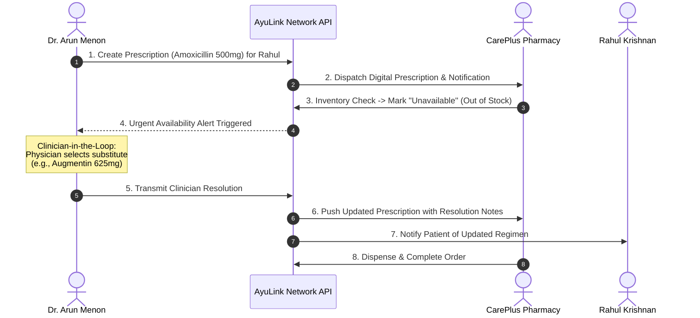

# AyuLink System Architecture

AyuLink is a structured healthcare digital prescription and pharmacy coordination network designed with clinical safety, privacy-preserving inventory sharing, and clinician-in-the-loop decision autonomy.

## 1. High-Level Architecture Diagram

```
+-------------------------------------------------------------------------------+
|                               Frontend (React + Vite)                          |
|  - Doctor Portal (Prescriptions, AI History Summary, Safety Advisories)       |
|  - Pharmacy Portal (Digital Inbox, Live Availability, POS Sync, Demand Intel) |
|  - Patient Portal (Medicine Availability Search, Prescription Tracking)       |
+---------------------------------------+---------------------------------------+
                                        | HTTP REST & Event Polling
                                        v
+-------------------------------------------------------------------------------+
|                               Backend (FastAPI)                               |
|  /auth         - Role-based Authentication & Demo Profiles                    |
|  /doctors      - Clinical Dashboard & Structured Templates                    |
|  /prescriptions- Digital Handoff, Availability Checks, Clinician Resolution   |
|  /medicines    - Privacy-Preserving Availability Search (RxNorm Concept)      |
|  /pharmacies   - Pharmacy Profiles & Internal Inventory Management            |
|  /inventory    - Availability State Updates & POS/ERP Sync Simulation         |
|  /notifications- Real-time Alerting Feed (Doctor <-> Pharmacy)                |
|  /demand       - Aggregated Demand Intelligence & Supply Gap Detection        |
|  /ai           - Assistive History Summarizer & Conservative Safety Engine    |
|  /demo         - Deterministic Demo Scenario Reset Controller                 |
+---------------------------------------+---------------------------------------+
                                        | SQLAlchemy ORM
                                        v
+-------------------------------------------------------------------------------+
|                       Database (PostgreSQL / SQLite)                          |
|  users, doctors, patients, pharmacies, medicines, inventory, prescriptions,   |
|  prescription_items, notifications, medicine_searches, demand_metrics,       |
|  prescription_templates                                                      |
+-------------------------------------------------------------------------------+
```

## 2. Core Operational Workflows

### A. Structured Digital Prescription & Clinician Exception Resolution Loop


### B. Privacy-Preserving Medicine Availability Search
- **Patient Action**: Searches generic or brand name (e.g. *Paracetamol 500 mg*).
- **Network Response**: Returns participating pharmacies within regional radius (e.g. Thrissur Metro), semantic status (`Available`, `Unavailable`, `Uncertain`), and last-updated timestamp.
- **Privacy Enforcement**: Internal physical stock counts, purchase costs, and pharmacy margins are filtered on the backend and are NEVER exposed to client queries.

### C. Assistive AI & Clinical Safety Layer
- **Core Principle**: *AI assists. Clinicians decide.*
- **Safety Engine**: Real-time cross-referencing against RxNorm identifiers and contraindication matrices (dual NSAIDs, macrolide-statin co-administration, penicillin hypersensitivity).
- **Patient History Summary**: Synthesizes verified longitudinal prescription encounters without inventing or diagnosing history.
- **Demand Intelligence**: Weighted heuristic score combining search volume, prescription inflow, and regional coverage to flag potential supply bottlenecks without autonomous stocking mandates.
